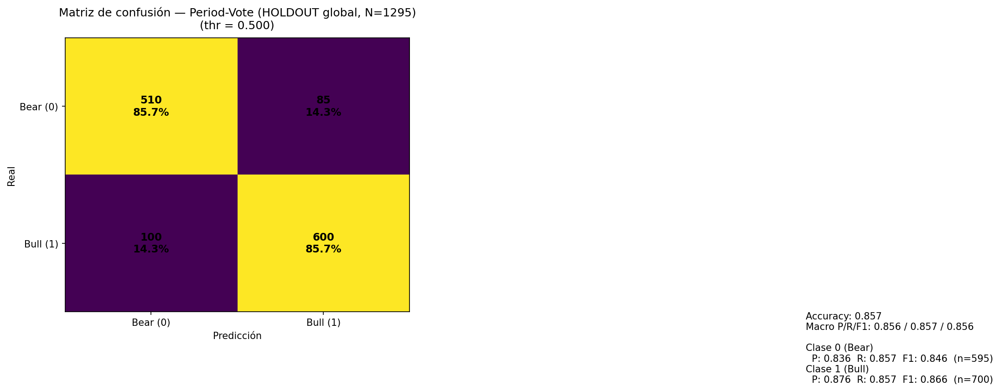
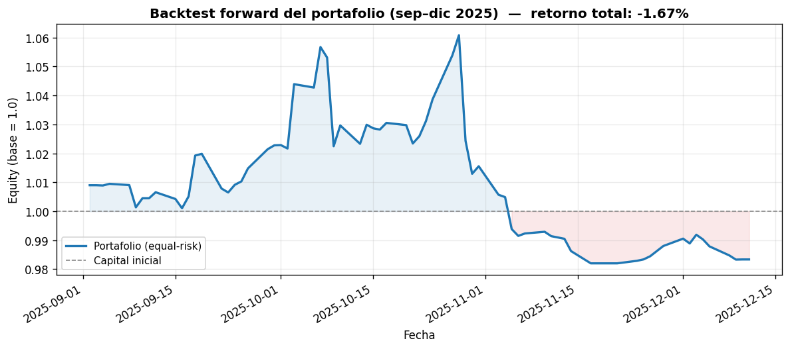

# Predicción de la dirección de acciones tecnológicas con ensembles + sentimiento FinBERT

Proyecto final de la *Tecnicatura en Ciencia de Datos* (módulo de Machine Learning: clasificación y regresión).

Sistema end-to-end que predice la **dirección diaria** (sube / baja) del precio de acciones tecnológicas
combinando **indicadores técnicos**, **datos macroeconómicos (FRED)**, **fundamentales (FMP)** y
**sentimiento de noticias procesado con FinBERT**, mediante un **ensemble por regímenes + stacking**.
Incluye un **backtest forward** out-of-sample y un **backtest de portafolio** con asignación equal-risk.

> ⚠️ **Aviso**: proyecto educativo / de investigación. **No** constituye asesoramiento financiero.

---

## 🎯 Qué demuestra este proyecto

- **Pipeline de ML completo**: ingesta de datos por API → feature engineering → entrenamiento → calibración → evaluación → backtesting.
- **Ensembles avanzados**: modelos por régimen temporal (2000–2019 vs 2020–2025) combinados por *weighted vote* y *stacking*, con **umbrales de decisión optimizados** por F1.
- **NLP financiero**: extracción de noticias (Finnhub → Google News RSS → Yahoo) y scoring de sentimiento con **FinBERT** (`yiyanghkust/finbert-tone`).
- **Integración de múltiples fuentes**: precios y fundamentales de *Financial Modeling Prep (FMP)*, series macro de *FRED*, titulares de *Finnhub*.
- **Evaluación rigurosa**: holdout temporal, matrices de confusión, *permutation importance*, *drift* entre periodos.
- **Backtesting cuantitativo**: estrategias *Stacking puro* vs *Stacking + filtro ADX*, métricas de win-rate, Sharpe, max drawdown y construcción de portafolio multi-activo.

---

## 📓 Notebooks

| Notebook | Descripción |
|---|---|
| [`notebooks/modeloparapresentar_finbertreal.ipynb`](notebooks/modeloparapresentar_finbertreal.ipynb) | Caso profundo sobre **NVDA**: EDA, sentimiento **FinBERT real**, ensemble por régimen, matrices de confusión e importancia de variables. |
| [`notebooks/modelomejoradoparalinkedin.ipynb`](notebooks/modelomejoradoparalinkedin.ipynb) | Pipeline **multi-ticker** (AAPL, AMD, META, MSFT, NVDA) + backtest de portafolio. |
| [`notebooks/modelomejoradoparalinkedin_mejoras.ipynb`](notebooks/modelomejoradoparalinkedin_mejoras.ipynb) | Versión refactorizada del anterior (manejo robusto de claves vía variables de entorno y helpers de red). |

---

## 🧠 Arquitectura del modelo

```
Precios (FMP) ─┐
Macro (FRED) ──┤
Fundamentales ─┼─► Feature engineering ─► Modelo P1 (2000–2019) ─┐
   (FMP)       │   (técnicos: retornos,     Modelo P2 (2020–2025) ─┼─► Weighted vote / Stacking
Noticias ──────┘    EMA, volatilidad, ADX)                         │   (umbrales óptimos por F1)
 (Finnhub →                                                        ▼
  FinBERT)                                              Señal direccional + Backtest
```

Los modelos base incluyen **XGBoost**, **LightGBM**, **RandomForest** y **LogisticRegression**,
combinados en un meta-modelo de *stacking*.

---

## 📊 Resultados

### Clasificación (holdout temporal — *period vote*)

| Ticker | F1 | Accuracy |
|--------|------|------|
| AAPL | 0.882 | 0.885 |
| AMD  | 0.851 | 0.857 |
| META | 0.903 | 0.876 |
| MSFT | 0.871 | 0.863 |
| NVDA | 0.868 | 0.859 |

<p align="center">
  
</p>
<p align="center"><sub>Matriz de confusión en el holdout temporal (ensemble <i>period vote</i>).</sub></p>

### Backtest forward (sep–dic 2025, *Stacking + ADX*)

| Ticker | Trades | Win-rate | Sharpe | Retorno total | Max DD |
|--------|:------:|:--------:|:------:|:-------------:|:------:|
| AMD  | 26 | 50.0% | **1.72** | **+27.7%** | -11.7% |
| AAPL | 56 | 48.2% | 0.37 | +1.5% | -6.5% |
| NVDA | 32 | 43.8% | -0.81 | -7.1% | -14.9% |
| MSFT | 27 | 48.2% | -0.77 | -2.6% | -5.3% |
| META | 20 | 40.0% | -1.75 | -12.1% | -16.6% |

> El forward (out-of-sample real) muestra resultados **mixtos** frente a la fuerte performance en
> holdout — un recordatorio honesto de la diferencia entre validación histórica y mercado real.
> Ver `results/backtest/multi_ticker_pnl_summary.csv` y `results/backtest/portfolio_backtest_aggregated.csv` para el detalle.

<p align="center">
  
</p>
<p align="center"><sub>Equity curve del portafolio (equal-risk): llegó a +6% y devolvió las ganancias hasta cerrar en −1.7%.</sub></p>

---

## 🔍 Resultados y limitaciones (análisis crítico)

La diferencia entre el **holdout** (F1 ≈ 0.85–0.90) y el **forward** (Sharpe mayormente
negativo, portafolio −1.7%) es el hallazgo más interesante del proyecto y vale la pena entenderlo
en lugar de ocultarlo:

- **Holdout temporal ≠ mercado real.** Aunque la validación respeta el orden cronológico, los
  umbrales de decisión y los pesos del ensemble se **optimizaron sobre el holdout**, lo que infla
  la métrica reportada respecto a datos verdaderamente no vistos (un sesgo de optimización clásico).
- **Cambio de régimen.** El forward (sep–dic 2025) es un período corto (~3 meses, 20–56 trades por
  ticker) y puede no parecerse a los regímenes de entrenamiento (2000–2019 / 2020–2025). Con tan
  pocas operaciones, el Sharpe tiene **alta varianza** y poca significancia estadística.
- **Dispersión entre activos.** AMD fue claramente rentable (Sharpe 1.7, +27.7%) mientras META
  perdió (−12%). Esto sugiere que la señal **no generaliza de forma homogénea** y que el resultado
  agregado depende mucho de pocos activos.
- **Fricciones no modeladas por completo.** Costos de transacción, slippage y disponibilidad real
  de noticias (cobertura de Finnhub variable por fecha) afectan el desempeño *live* y no están
  totalmente capturados en el backtest.
- **Riesgo de look-ahead en features.** Fundamentales (FMP) y macro (FRED) se inyectan con
  *forward-fill* del último valor conocido; aunque se cuida la fecha de corte, es un punto sensible
  a auditar en cualquier sistema de trading.

### Qué haría a continuación
1. **Validación walk-forward / purged K-fold** con *embargo* para eliminar el sesgo de optimización de umbrales.
2. **Modelar costos** (comisiones + slippage) y *position sizing* por volatilidad dentro del backtest.
3. **Ampliar la ventana out-of-sample** y testear en más activos para medir generalización real.
4. **Recalibración periódica** del ensemble y monitoreo de *drift* entre el régimen de entrenamiento y el actual.

> **Conclusión honesta:** el sistema demuestra capacidad predictiva fuerte *in-sample* pero
> rendimiento *out-of-sample* modesto — un resultado realista que refleja lo difícil que es trasladar
> precisión de clasificación a rentabilidad operativa neta.

---

## 📁 Estructura del repositorio

```
.
├── notebooks/                      # Los 3 notebooks del proyecto
│   ├── modeloparapresentar_finbertreal.ipynb     # NVDA + FinBERT (caso profundo)
│   ├── modelomejoradoparalinkedin.ipynb          # Multi-ticker + portafolio
│   └── modelomejoradoparalinkedin_mejoras.ipynb  # Versión refactorizada
├── data/                           # Datos de entrada
│   ├── sp500.csv                   #   Benchmark de mercado
│   └── sp500_test.csv
├── results/
│   ├── ensembles/                  # <TICKER>_ensemble.json (pesos + umbrales)
│   │                               # <TICKER>_results_summary.json (métricas de clasificación)
│   ├── backtest/                   # Forwards por ticker, P&L y backtest de portafolio
│   │                               #   multi_ticker_pnl_summary.csv, per_ticker_strategy_metrics.csv,
│   │                               #   portfolio_backtest_*.csv, portfolio_weights_equal_risk.csv
│   └── analysis/                   # features_*_2periods.csv, imp_permutation_*.csv
├── figures/                        # cm_*.png (matrices de confusión) + portfolio_equity_curve.png
├── models/                         # Modelos entrenados *.joblib (excluidos del repo por tamaño)
├── requirements.txt
├── .env.example                    # Plantilla de claves de API
└── LICENSE                         # MIT
```

> Los modelos entrenados (`models/*.joblib`) se excluyen del repositorio por tamaño; se regeneran al ejecutar los notebooks.

---

## 🚀 Cómo ejecutarlo

1. **Instalar dependencias**
   ```bash
   pip install -r requirements.txt
   ```

2. **Configurar las claves de API** (gratuitas en [FMP](https://site.financialmodelingprep.com/), [FRED](https://fred.stlouisfed.org/docs/api/api_key.html) y [Finnhub](https://finnhub.io/)).
   Copiá `.env.example` y exportá las variables. En **Windows PowerShell**:
   ```powershell
   $env:FMP_API_KEY     = "tu_clave_fmp"
   $env:FRED_API_KEY    = "tu_clave_fred"
   $env:FINNHUB_API_KEY = "tu_clave_finnhub"
   ```
   Los notebooks leen las claves con `os.getenv(...)`; nunca se versionan claves en el código.

3. **Abrir y ejecutar** cualquiera de los notebooks en `notebooks/` con Jupyter / VS Code.

> 📌 **Nota sobre rutas:** los artefactos incluidos (`results/`, `figures/`) se generaron ejecutando
> los notebooks desde la raíz del proyecto, por lo que referencian archivos por nombre (p. ej.
> `sp500.csv`). Tras la reorganización en carpetas, para **re-ejecutarlos** conviene ajustar las
> rutas de entrada/salida a la nueva estructura (`data/`, `results/`, `models/`) o lanzarlos desde
> la raíz. Los resultados ya provistos permiten inspeccionar el proyecto sin necesidad de re-correrlo.

---

## 🛠️ Stack técnico

`Python` · `pandas` · `numpy` · `scikit-learn` · `XGBoost` · `LightGBM` ·
`PyTorch` + `Transformers` (FinBERT) · `matplotlib` · APIs `FMP` / `FRED` / `Finnhub`

---

## 👤 Autor

**Fabrizio Sola** — Tecnicatura en Ciencia de Datos.

## 📄 Licencia

Distribuido bajo licencia **MIT**. Ver [`LICENSE`](LICENSE) para más detalles.
